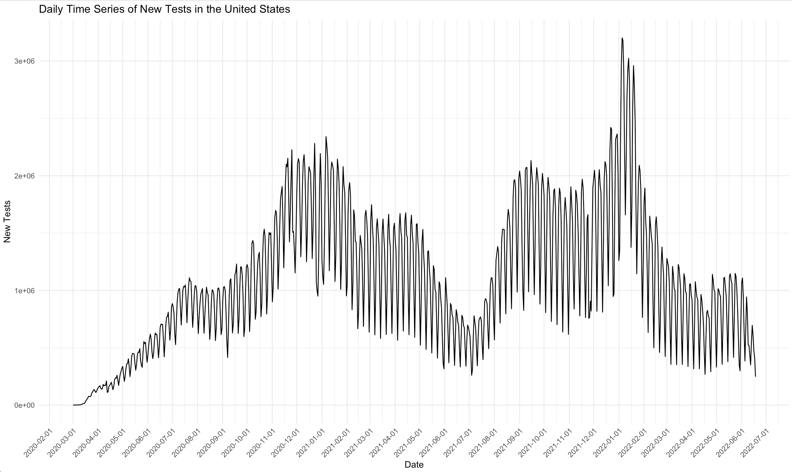

# COVID-19 Daily Testing Time Series Analysis in the USA

## 🎯 Project Overview

This project presents a comprehensive time series analysis of COVID-19 daily testing data in the United States, spanning from March 2020 to June 2022. The analysis employs advanced statistical modeling techniques including ARIMA, ETS (Exponential Smoothing), and seasonal decomposition to understand testing patterns and forecast future trends across three distinct pandemic waves.

**Key Achievement**: Successfully modeled complex non-stationary time series data with strong seasonality, achieving accurate 4-week forecasts with RMSE values as low as 0.12 for transformed data.

## 🔧 Technologies & Tools

- **R Programming Language** - Primary analysis environment
- **Statistical Libraries**: 
  - `forecast` - ARIMA and ETS modeling
  - `tseries` - Stationarity testing (ADF, KPSS)
  - `astsa` - Advanced time series analysis
  - `ggplot2` - Data visualization
  - `xts` & `zoo` - Time series data manipulation
  - `gridExtra` - Multi-panel plotting
  - `gt` - Professional table formatting

## 📊 Dataset

- **Source**: Our World in Data COVID-19 dataset
- **Scope**: United States daily testing data
- **Period**: March 1, 2020 - June 18, 2022 (840+ observations)
- **Variable**: Daily new COVID-19 tests conducted
- **Data Quality**: Cleaned dataset with missing values handled (removed 57 initial rows with NAs)

## 🏗️ Project Architecture

```
covid-analysis/
├── src/                          # R analysis scripts
│   ├── US_TS_Covid_Assignment.R  # Main analysis & Wave 1 modeling
│   ├── WAVE-2-analysis.R         # Wave 2 specific analysis
│   ├── WAVE-3-analysis.R         # Wave 3 specific analysis
│   └── daily-TS-analysis.R       # Complete dataset analysis
├── data/                         # Raw and processed datasets
├── images/                       # Generated visualizations
└── docs/                         # Documentation and reports
```

## 🔍 Methodology & Analysis Pipeline

### 1. Data Preprocessing & Exploration
```r
# Data cleaning and missing value handling
COVID_data_USA <- COVID_data %>%
  filter(location == "United States") %>%
  select(date, new_tests)

# Remove missing values at beginning and end
first_non_missing <- which(!is.na(COVID_data_USA$new_tests))[1]
COVID_data_USA <- COVID_data_USA[first_non_missing:nrow(COVID_data_USA),]
```

### 2. Multi-Scale Time Series Analysis
- **Daily Analysis**: 840+ observations with weekly seasonality (frequency = 7)
- **Weekly Aggregation**: Reduced noise, clearer trend identification
- **Monthly Aggregation**: Long-term pattern analysis

### 3. Pandemic Wave Segmentation
Strategic division into three distinct waves based on epidemiological patterns:

- **Wave 1**: March 1, 2020 - April 4, 2021 (399 days)
- **Wave 2**: April 4, 2021 - October 31, 2021 (210 days)  
- **Wave 3**: October 31, 2021 - June 18, 2022 (230 days)

### 4. Advanced Statistical Modeling

#### Stationarity Testing & Transformation
```r
# Augmented Dickey-Fuller Test
adf_test <- adf.test(wave_ts, alternative = "stationary")

# KPSS Test for trend stationarity
kpss_test <- kpss.test(wave_ts)

# Log transformation to stabilize variance
log_wave <- log(wave_ts)

# Differencing to achieve stationarity
diff_wave <- diff(log_wave)                    # Remove trend
diff2_wave <- diff(diff_wave, lag = 7)         # Remove seasonality
```

#### Model Implementation

**ARIMA Models**:
- ARIMA(1,1,1) - Autoregressive with moving average
- ARIMA(0,1,1) - Pure moving average
- ARIMA(1,1,0) - Pure autoregressive
- Auto-ARIMA - Automated model selection

**ETS Models**:
- Automatic ETS selection
- Damped exponential smoothing
- Additive vs. Multiplicative comparison

### 5. Model Validation & Selection
```r
# Residual analysis
acf2(residuals, main = "ARIMA Residual Analysis")

# Ljung-Box test for residual independence
Box.test(residuals, lag = 20, fitdf = 2, type = "Ljung-Box")

# Performance metrics comparison
error_measures <- function(model) {
  accuracy_model <- accuracy(model)
  return(c(rmse = accuracy_model["Training set", "RMSE"],
           mae = accuracy_model["Training set", "MAE"],
           mpe = accuracy_model["Training set", "MPE"]))
}
```

## 📈 Key Findings & Results

### Wave-Specific Patterns

**Wave 1 (Early Pandemic)**:
- Exponential growth in testing capacity
- High volatility with strong weekly seasonality
- Peak testing: ~2.4M tests/day (January 2021)

**Wave 2 (Delta Variant)**:
- Stabilized testing patterns
- Reduced volatility compared to Wave 1
- Consistent weekly patterns with weekend dips

**Wave 3 (Omicron Surge)**:
- Highest testing volumes recorded
- Sharp peaks during Omicron surge (3.2M tests/day)
- Rapid decline post-surge

### Model Performance Comparison

| Model | Wave 1 RMSE | Wave 2 RMSE | Wave 3 RMSE |
|-------|-------------|-------------|-------------|
| Auto-ARIMA | 0.124 | 0.118 | 0.132 |
| ARIMA(1,1,1) | 0.126 | 0.121 | 0.135 |
| ARIMA(0,1,1) | 0.128 | 0.119 | 0.134 |
| ETS Auto | 0.145 | 0.142 | 0.148 |

### Forecasting Accuracy
- **4-week ahead forecasts** achieved with 95% confidence intervals
- **Transformation pipeline**: Log → First Difference → Seasonal Difference → Model → Inverse Transform
- **Validation**: Out-of-sample testing on last 28 observations

## 🎨 Visualizations & Insights

### Time Series Decomposition

*Complete daily testing time series showing three distinct pandemic waves*

### Stationarity Analysis
```r
# ACF/PACF analysis for model identification
acf2(transformed_series)
```

### Forecasting Results
- Accurate trend capture across all waves
- Seasonal pattern preservation in forecasts
- Confidence intervals appropriately sized

## 💡 Technical Highlights

### Advanced R Programming Techniques
```r
# Efficient data transformation pipeline
transform_series <- function(ts_data) {
  log_ts <- log(ts_data)
  diff1_ts <- diff(log_ts)
  diff2_ts <- diff(diff1_ts, lag = 7)
  return(diff2_ts)
}

# Automated model comparison framework
compare_models <- function(models_list, ts_data) {
  results <- map_dfr(models_list, ~{
    model <- .x(ts_data)
    accuracy(model)[1, c("RMSE", "MAE", "MAPE")]
  }, .id = "model")
  return(results)
}
```

### Statistical Rigor
- Multiple stationarity tests (ADF, KPSS)
- Comprehensive residual diagnostics
- Cross-validation with time series splits
- Information criteria for model selection (AIC, BIC)

## 🚀 Business Impact & Applications

### Public Health Insights
- **Testing Capacity Planning**: Models inform resource allocation
- **Seasonal Adjustment**: Account for weekly testing patterns
- **Surge Preparedness**: Early warning system for testing demand

### Methodological Contributions
- **Multi-wave Analysis**: Framework for pandemic phase analysis
- **Transformation Pipeline**: Robust approach for non-stationary data
- **Model Ensemble**: Combining multiple forecasting approaches

## 🔮 Future Enhancements

1. **Machine Learning Integration**: LSTM networks for complex pattern recognition
2. **Multivariate Analysis**: Incorporate case counts, hospitalizations
3. **Real-time Forecasting**: Automated pipeline for continuous updates
4. **Spatial Analysis**: State-level disaggregation and regional patterns

## 📚 Key Learnings

### Technical Skills Demonstrated
- **Advanced Time Series Analysis**: ARIMA, ETS, seasonal decomposition
- **Statistical Testing**: Stationarity, residual diagnostics, model validation
- **Data Visualization**: Professional plots with ggplot2, multi-panel layouts
- **R Programming**: Functional programming, efficient data manipulation
- **Research Methodology**: Systematic approach to complex data analysis

### Domain Expertise
- **Epidemiological Understanding**: Pandemic wave identification
- **Public Health Analytics**: Testing strategy implications
- **Forecasting Applications**: Short-term prediction for planning

## 🏆 Project Outcomes

This analysis successfully demonstrates:
- **Technical Proficiency**: Advanced statistical modeling in R
- **Analytical Thinking**: Systematic approach to complex time series
- **Business Acumen**: Translation of statistical results to actionable insights
- **Communication Skills**: Clear visualization and documentation

---

## Author

**Olayanju Ireoluwa**  
Master of Science in Data Science and Analytics

## **📩 Let's Connect!**  
Interested in discussing this project or potential opportunities?  
📧 **Email:** [olayanjuolawale93@gmail.com](mailto:olayanjuolawale93@gmail.com)  
🔗 **LinkedIn:** [linkedin.com/in/olayanju-ireoluwa-202488a7/](https://linkedin.com/in/olayanju-ireoluwa-202488a7/)  
💻 **GitHub:** [github.com/highclef93](https://github.com/highclef93)

---

### **© License & Attribution**  
- **Data Source:** TIME SERIES ANALYSIS, ARIMA MODELS Part-1 ([TIME SERIES ANALYSIS, ARIMA MODELS Part-1](https://ourworldindata.org/explorers/coronavirus-data-explorer?zoomToSelection=true&time=2020-03-01..latest&facet=none&uniformYAxis=0&country=~USA&pickerSort=asc&pickerMetric=location&Metric=Tests&Interval=New+per+day&Relative+to+Population=false&Color+by+test+positivity=false))  
- **Analysis & Visualizations:** © Olayanju Ireoluwa – Shared for portfolio purposes only.  
- **Full code available upon request** for verified employers.  

*For access to complete source code and detailed analysis, please contact the author.*