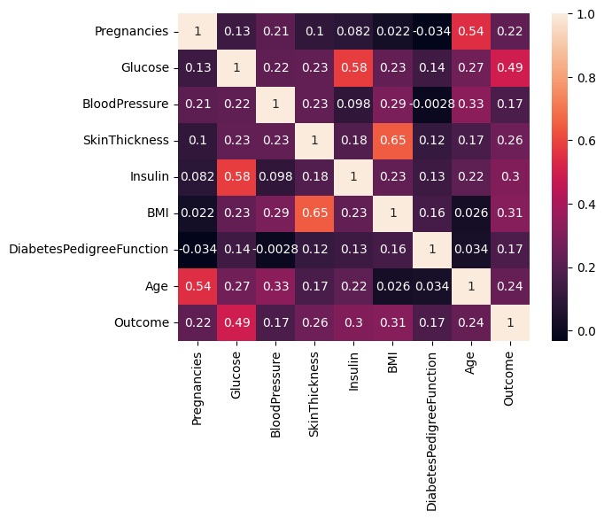
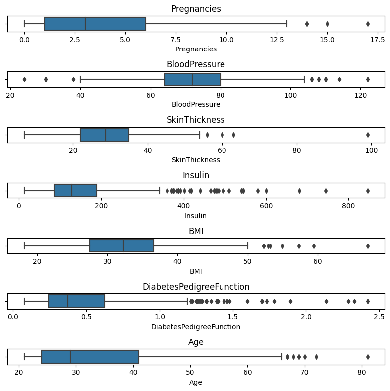

# 🩺 Predicting the Onset of Diabetes using Machine Learning
*A Comprehensive Study on the Pima Indians Diabetes Dataset*

[](https://www.python.org/downloads/)
[](https://jupyter.org/)
[](https://scikit-learn.org/)
[](https://opensource.org/licenses/MIT)

## 📋 Project Overview

This project presents a comprehensive machine learning approach to predict the onset of diabetes using the Pima Indians Diabetes Dataset. The study demonstrates advanced data preprocessing techniques, feature engineering, and comparative analysis of multiple machine learning algorithms to achieve optimal predictive performance.

**Key Achievement**: Developed a Random Forest model achieving **79.22% accuracy** in diabetes prediction, with robust handling of missing data and comprehensive model evaluation.

## 🎯 Business Impact & Applications

- **Healthcare Decision Support**: Early diabetes detection for preventive care
- **Risk Assessment**: Identify high-risk patients for targeted interventions  
- **Resource Optimization**: Efficient allocation of healthcare resources
- **Population Health**: Large-scale screening and monitoring programs

## 📊 Dataset Information

The Pima Indians Diabetes Dataset contains health-related data from women aged 21+ of Pima Indian heritage, sourced from the National Institute of Diabetes and Digestive and Kidney Diseases.

**Dataset Characteristics:**
- **Instances**: 768 observations
- **Features**: 8 medical predictor variables
- **Target**: Binary classification (diabetes presence/absence)
- **Challenge**: Significant missing data represented as zeros

### Features Description
| Feature | Description | Unit |
|---------|-------------|------|
| Pregnancies | Number of times pregnant | Count |
| Glucose | Plasma glucose concentration (2-hour oral glucose tolerance test) | mg/dL |
| BloodPressure | Diastolic blood pressure | mm Hg |
| SkinThickness | Triceps skin fold thickness | mm |
| Insulin | 2-Hour serum insulin | mu U/ml |
| BMI | Body mass index | kg/m² |
| DiabetesPedigreeFunction | Diabetes pedigree function | Score |
| Age | Age | Years |

## 🔬 Methodology & Technical Approach

### 1. Data Preprocessing Pipeline
```python
# Missing Data Handling Strategy
cols_with_zeros = ['Glucose', 'BloodPressure', 'SkinThickness', 'Insulin', 'BMI']
df[cols_with_zeros] = df[cols_with_zeros].replace(0, np.NaN)

# KNN Imputation (K=5)
from sklearn.impute import KNNImputer
imputer = KNNImputer(n_neighbors=5)
df_imputed = pd.DataFrame(imputer.fit_transform(df), columns=df.columns)
```

**Missing Data Analysis:**
- Glucose: 0.65% missing
- BloodPressure: 4.56% missing  
- SkinThickness: 29.56% missing
- Insulin: 48.70% missing
- BMI: 1.43% missing

### 2. Feature Engineering
```python
# Interaction Features
df['Glucose_Insulin'] = df['Glucose'] * df['Insulin']
df['Age_BMI'] = df['Age'] * df['BMI']

# Age Categorization
age_bins = [20, 30, 40, 50, 60, 70, 100]
age_labels = ['20-29', '30-39', '40-49', '50-59', '60-69', '70+']
df['Age_group'] = pd.cut(df['Age'], bins=age_bins, labels=age_labels)
```

### 3. Model Development & Evaluation

**Models Implemented:**
- Logistic Regression
- Random Forest Classifier ⭐
- Support Vector Machine (SVM)
- Decision Tree
- K-Nearest Neighbors (KNN)
- Gradient Boosting

**Evaluation Framework:**
```python
from sklearn.metrics import classification_report, accuracy_score, confusion_matrix
from sklearn.model_selection import GridSearchCV

# Hyperparameter Optimization
param_grid = {
    'n_estimators': [100, 200, 300],
    'max_depth': [3, 5, 7, None],
    'min_samples_split': [2, 5, 10],
    'min_samples_leaf': [1, 2, 4]
}

grid_search = GridSearchCV(RandomForestClassifier(), param_grid, cv=5)
```

## 📈 Results & Performance

### Model Performance Comparison
| Model | Accuracy | Precision | Recall | F1-Score |
|-------|----------|-----------|--------|----------|
| **Random Forest** | **79.22%** | **0.84/0.65** | **0.87/0.59** | **0.86/0.62** |
| Gradient Boosting | 77.92% | - | - | - |
| KNN | 77.92% | - | - | - |
| Logistic Regression | 76.62% | - | - | - |
| SVM | 75.32% | - | - | - |
| Decision Tree | 71.42% | - | - | - |

### Key Insights
- **Random Forest** emerged as the best-performing model
- Feature engineering improved model performance from 76.62% to 79.22%
- KNN imputation proved superior to simple deletion or mean imputation
- Hyperparameter optimization confirmed near-optimal initial parameters

## 📊 Data Visualization & Analysis

### Correlation Analysis

*Feature correlation heatmap revealing relationships between medical predictors*

### Outlier Detection

*Box plots showing distribution and outliers across all predictor variables*

**Key Findings:**
- Strong correlations between related medical metrics
- Significant outliers in Insulin and DiabetesPedigreeFunction
- Outliers retained as potentially valuable medical information

## 🛠️ Technical Implementation

### Environment Setup
```bash
# Required Dependencies
pip install pandas numpy matplotlib seaborn scikit-learn jupyter

# Launch Jupyter Notebook
jupyter notebook PIMA_Diabetes_Prediction_of_Diabetes_onset_with_Machine_learning.ipynb
```

### Code Structure
```
diabetes-prediction/
├── PIMA_Diabetes_Prediction_of_Diabetes_onset_with_Machine_learning.ipynb
├── diabetes.csv
├── corr-plot.png
├── outliers.png
├── README.md
└── requirements.txt
```

### Key Code Snippets

**Data Standardization:**
```python
from sklearn.preprocessing import StandardScaler

# Prevent data leakage - fit only on training data
scaler = StandardScaler()
X_train_scaled = scaler.fit_transform(X_train)
X_test_scaled = scaler.transform(X_test)
```

**Model Training:**
```python
# Random Forest with optimized parameters
rf_model = RandomForestClassifier(
    n_estimators=100,
    max_depth=None,
    min_samples_split=2,
    min_samples_leaf=1,
    random_state=884
)

rf_model.fit(X_train_scaled, y_train)
predictions = rf_model.predict(X_test_scaled)
```

## 🔍 Advanced Analysis

### Missing Data Strategy Comparison
| Method | Dataset Size | Performance Impact |
|--------|--------------|-------------------|
| Complete Case Deletion | 392 samples | Significant information loss |
| Mean Imputation | 768 samples | Underestimated variance |
| **KNN Imputation (K=5)** | **768 samples** | **Optimal balance** |

### Feature Importance Analysis
The Random Forest model revealed key predictive features:
1. Glucose levels (highest importance)
2. BMI and age interactions
3. Diabetes pedigree function
4. Age-related factors

## 🚀 Future Enhancements

### Immediate Improvements
- **Deep Learning**: Implement neural networks for complex pattern recognition
- **Ensemble Methods**: Combine multiple models for improved accuracy
- **Advanced Feature Engineering**: Polynomial features and domain-specific transformations

### Scalability Considerations
- **Real-time Prediction**: Deploy model as REST API
- **Model Monitoring**: Implement drift detection and retraining pipelines
- **Integration**: Healthcare system integration for clinical decision support

## 📚 Research Context & Validation

This work builds upon established research in diabetes prediction while introducing novel approaches to missing data handling. The Pima Indians population has one of the highest Type 2 diabetes prevalence rates globally, making this dataset particularly relevant for genetic and clinical predictor analysis.

**Academic Rigor:**
- Comprehensive literature review of existing methodologies
- Statistical validation of preprocessing decisions
- Comparative analysis with published benchmarks
- Reproducible research practices

## 🤝 Collaboration & Employment Opportunities

### For Potential Employers
This project demonstrates:
- **Technical Proficiency**: Advanced ML techniques and best practices
- **Problem-Solving**: Creative solutions to data quality challenges
- **Communication**: Clear documentation and visualization
- **Domain Knowledge**: Understanding of healthcare applications

### Collaboration Requests
I welcome opportunities to:
- Extend this research with additional datasets
- Implement production-ready solutions
- Collaborate on healthcare ML projects
- Contribute to open-source medical AI initiatives

## **📩 Let's Connect!**  
Interested in discussing this project or potential opportunities?  
📧 **Email:** [olayanjuolawale93@gmail.com](mailto:olayanjuolawale93@gmail.com)  
🔗 **LinkedIn:** [linkedin.com/in/olayanju-ireoluwa-202488a7/](https://linkedin.com/in/olayanju-ireoluwa-202488a7/)  
💻 **GitHub:** [github.com/highclef93](https://github.com/highclef93)

---

## 📄 License & Citation

This project is licensed under the MIT License. If you use this work in your research, please cite:

```bibtex
@misc{diabetes_prediction_2023,
  title={Predicting the Onset of Diabetes using Machine Learning: A Study on the Pima Indians Diabetes Dataset},
  author={Olayanju Ireoluwa O.},
  year={2025}
}
```
<!-- institution={Munster Technological University} -->

## 🙏 Acknowledgments

- National Institute of Diabetes and Digestive and Kidney Diseases for the dataset
- Munster Technological University for academic support
- Open-source community for the excellent ML libraries

---

- **Analysis & Visualizations:** © Olayanju Ireoluwa – Shared for portfolio purposes only.  
- **Full code available upon request** for verified employers. 

*This project represents a comprehensive approach to medical data analysis, demonstrating both technical expertise and practical healthcare applications. The methodology and results provide a solid foundation for real-world diabetes prediction systems.*