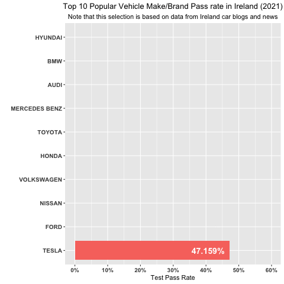
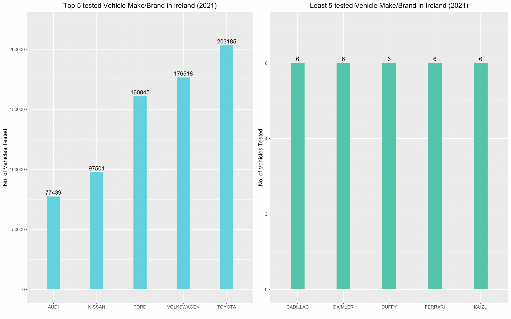
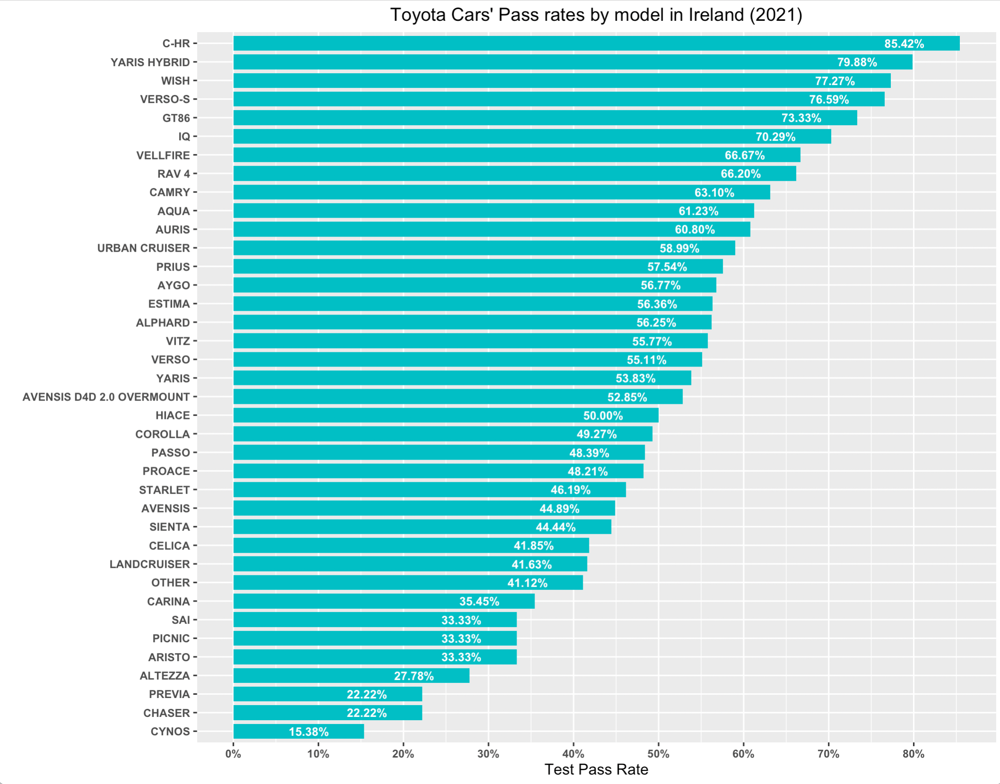
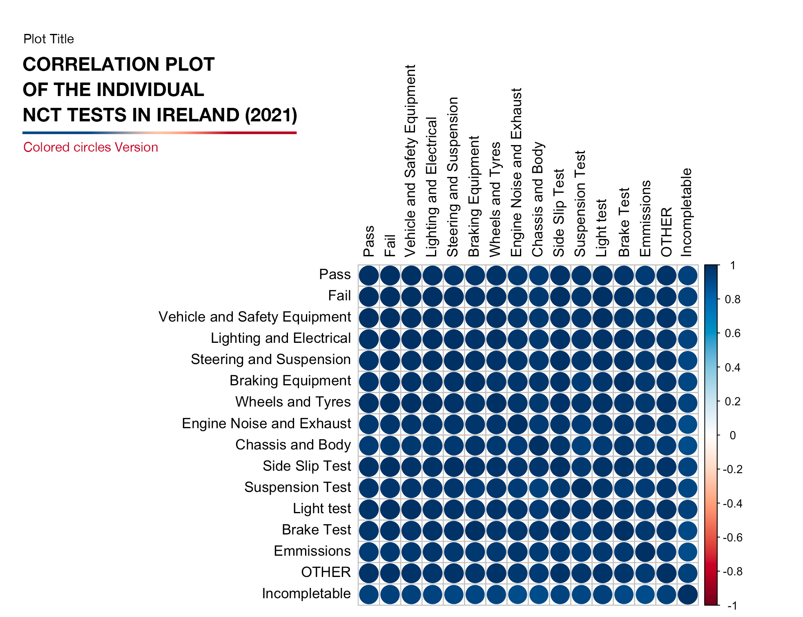
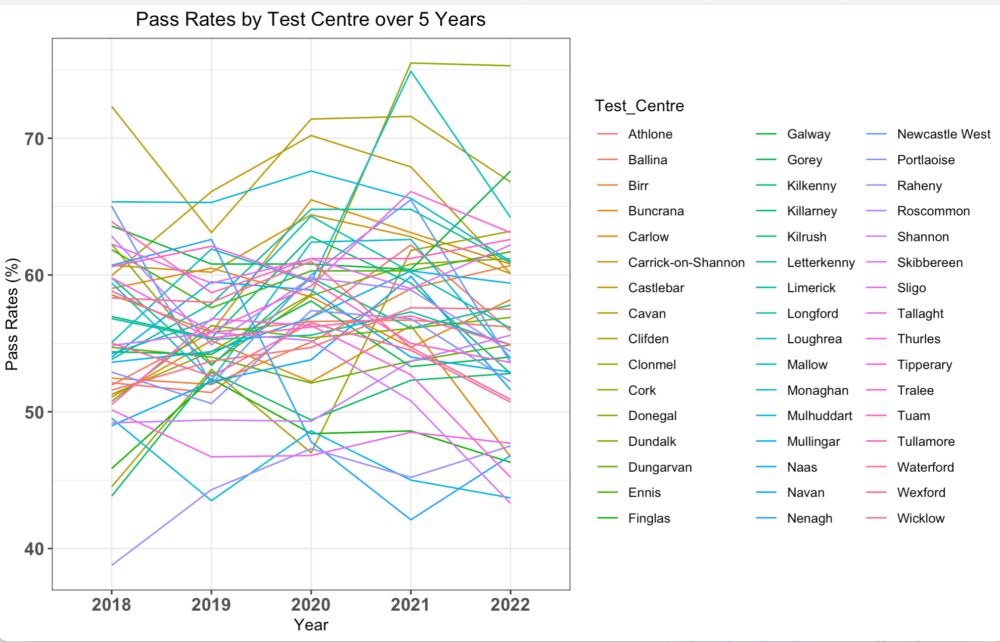

# **NCT Vehicle Roadworthiness Analysis & Visualization Portfolio**  

[](https://www.python.org/downloads/)
[](https://jupyter.org/)
[](https://scikit-learn.org/)
[](https://opensource.org/licenses/MIT)

## **Project Showcase: NCT Vehicle Roadworthiness Test Analysis (2021)**  

### **📌 Overview**  
This project analyzes the **National Car Test (NCT)** pass/fail rates for vehicles in Ireland (2021), exploring trends in vehicle performance, brand reliability, and test correlations. The goal was to extract meaningful insights using **R, ggplot2, dplyr, and interactive visualization techniques** to help stakeholders (consumers, manufacturers, policymakers) make data-driven decisions.  



---

## **🔍 Key Insights & Findings**  
### **1. Vehicle Performance by Brand**  
- **Toyota** had the highest number of vehicles tested (**203,185**) but ranked **5th in pass rates (52.8%)** among popular brands.  
- **Hyundai** had the **highest pass rate (61.2%)** among top brands.  
- **Tesla** had a **0% brake test failure rate**, indicating superior braking system performance.  

### **2. Top vs. Least Tested Vehicles**  

*Comparison of Top 5 vs. Least 5 Tested Vehicles*  

- **Top 5 Tested Brands:** Toyota, Volkswagen, Ford, Hyundai, Nissan  
- **Least 5 Tested Brands:** Isuzu, Ferrari, Duffy, Daimler, Cadillac  

### **3. Toyota Model-Specific Analysis**  
  
*Top 5 Toyota Models by Test Volume & Pass Rates*  

- **RAV4** had the **highest pass rate (66.2%)** among frequently tested models.  
- **Auris & Corolla** had lower pass rates despite high test volumes.  

### **4. Correlation Between Individual Tests**  
  
*Correlation Matrix of NCT Test Components*  

- **Braking Equipment Test** and **Brake Test** had a **1.00 correlation**.  
- **Vehicle and Safety Equipment Test** strongly correlated with overall pass rates.  

### **5. Evolution of Driving Test Pass Rates (2018-2022)**  

*Top 5 Driving Test Centers Over 5 Years*  

- **Cork** saw a **25% increase** in pass rates from 2018 to 2022.  
- **Clifden** maintained consistently high pass rates (~70%).  

---

## **🛠️ Technologies & Methods Used**  
- **Data Processing:** `dplyr`, `tidyr`  
- **Visualization:** `ggplot2`, `plotly` (interactive charts), `corrplot`  
- **Statistical Analysis:** Correlation tests, regression trends  
- **Dynamic Reporting:** `Shiny` (interactive dashboard)  
- **Geospatial Mapping:** `leaflet`, `sf`  

---

## **📂 Project Structure**  
```sh
NCT_Analysis_Portfolio/  
├── README.md               # Project overview (this file)  
├── images/                  # Contains all visualizations  
│   ├── image3.png          # Sample data table  
│   ├── image8.png          # Top vs. Least Tested Vehicles  
│   ├── image13.png         # Toyota Model Analysis  
│   ├── image23.jpeg        # Correlation Matrix  
│   └── image27.png         # Driving Test Trends  
├── code/                   # R scripts (available upon request)  
│   ├── data_cleaning.R  
│   ├── visualization.R  
│   └── shiny_app.R  
└── report/                 # Full analysis report (PDF)  
```  

---

## **💻 Key R Code Snippets**  

### **1. Data Cleaning & Aggregation**  
```r
# Combine Vehicle Make, Model, and Year into a single identifier  
vehicle.data$vehicle <- paste(  
  vehicle.data$`Vehicle Make`,  
  vehicle.data$`Vehicle Model`,  
  vehicle.data$`Year Of Birth`,  
  sep = "-"  
)  

# Calculate Pass/Fail Rates  
df_vehicle_pass_fail <- vehicle.data %>%  
  group_by(`Vehicle Make`) %>%  
  summarise(  
    Total = sum(Total, na.rm = TRUE),  
    Pass = sum(PASS, na.rm = TRUE),  
    Fail = sum(FAIL, na.rm = TRUE),  
    Pass_Rate = Pass / Total * 100  
  )  
```  

### **2. Interactive Visualization with `ggplotly`**  
```r
# Interactive Bar Plot of Pass Rates  
pass_rate_plot <- df_vehicle_pass_fail %>%  
  mutate(`Vehicle Make` = fct_reorder(`Vehicle Make`, Pass_Rate)) %>%  
  ggplot(aes(x = `Vehicle Make`, y = Pass_Rate, fill = `Vehicle Make`)) +  
  geom_col(width = 0.8) +  
  coord_flip() +  
  labs(title = "NCT Pass Rates by Vehicle Make (2021)")  

# Convert to interactive plot  
pass_rate_plot %>% ggplotly()  
```  

### **3. Correlation Analysis**  
```r
# Compute Correlation Matrix  
cor_matrix <- cor(  
  vehicle.data[, c("PASS %", "Vehicle and Safety Equipment %", "Brake Test %")],  
  method = "spearman"  
)  

# Visualize with `corrplot`  
corrplot(cor_matrix, method = "color", addCoef.col = "white")  
```  

### **4. Animated Bar Plot (Top 10 Brands)**  
```r
# Animated Plot with `gganimate`  
animated_plot <- Top10.popular.cars %>%  
  ggplot(aes(x = `Vehicle Make`, y = `Pass.rate(%)`, fill = `Vehicle Make`)) +  
  geom_col() +  
  transition_states(`Vehicle Make`, transition_length = 2, state_length = 1)  

animate(animated_plot, fps = 6)  
```  

### **5. Geospatial Mapping (Test Centers)**  
```r
# Plot Test Centers on Ireland Map  
ggplot() +  
  geom_sf(data = ireland_map, fill = "white", color = "black") +  
  geom_point(  
    data = test_centers,  
    aes(x = Longitude, y = Latitude, color = Test_Centre),  
    size = 4  
  ) +  
  labs(title = "Top 5 Driving Test Centers in Ireland")  
```  

---

## **🔍 How to Explore Further**  
### **For Employers & Recruiters:**  
This repository provides a **high-level overview** of the analysis. If you'd like to review the **full source code, raw datasets, or interactive Shiny dashboard**, please contact me at **[Your Email]** with the subject:  
**"Request: NCT Analysis Full Access – [Your Company Name]"**  

I’d be happy to provide:  
✅ Full R scripts  
✅ Interactive Shiny app deployment link  
✅ Extended report with deeper insights  

---

## **🎯 Why This Project Matters**  
- **Consumer Insights:** Helps buyers identify reliable car models.  
- **Manufacturer Feedback:** Highlights areas for improvement (e.g., braking systems in Toyotas).  
- **Policy Implications:** Supports road safety authorities in evaluating test effectiveness.  

---

## **🚀 Next Steps (If I Had More Time)**  
- Expand analysis to **multiple years** for trend comparisons.  
- Incorporate **geospatial clustering** of test centers.  
- Build a **predictive model** for pass/fail rates based on vehicle attributes.  

---

## **📩 Let's Connect!**  
Interested in discussing this project or potential opportunities?  
📧 **Email:** [olayanjuolawale93@gmail.com](mailto:olayanjuolawale93@gmail.com)  
🔗 **LinkedIn:** [linkedin.com/in/olayanju-ireoluwa-202488a7/](https://linkedin.com/in/olayanju-ireoluwa-202488a7/)  
💻 **GitHub:** [github.com/highclef93](https://github.com/highclef93)

---

### **© License & Attribution**  
- **Data Source:** Road Safety Authority (RSA) of Ireland ([NCT Statistics](https://www.rsa.ie/road-safety/statistics/nct-statistics-and-annual-reviews))  
- **Analysis & Visualizations:** © [Olayanju Ireoluwa] – Shared for portfolio purposes only.  
- **Full code available upon request** for verified employers.  