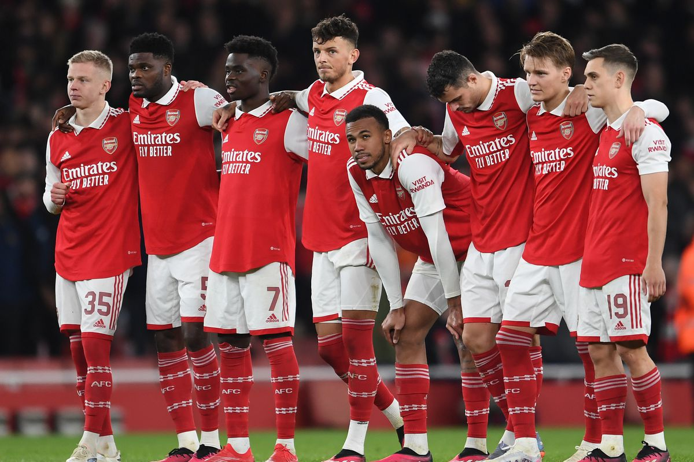

# Predicting Soccer Players' Market Value Using FIFA Data with Machine Learning



## Project Overview

This project leverages machine learning techniques to predict the market value of soccer players using data from the FIFA video game series. The research focuses on players from the top 5 European leagues (Premier League, La Liga, Bundesliga, Serie A, and Ligue 1) and explores how player attributes, performance metrics, and other factors influence their market valuation.

**Key Features:**
- Comprehensive data analysis of 2,614 players from top European leagues
- Implementation and comparison of 7 machine learning models
- Identification of key factors influencing player market value
- Advanced feature engineering and data visualization
- Rigorous model evaluation with cross-validation

## Project Structure

```bash
soccer-analytics/
│
├── assets/                  # All visual assets (71 files)
│   ├── Visualizations/      # (Grouped conceptually)
│   │   ├── EDA/
│   │   │   ├── Univariate/
│   │   │   └── Bivariate/
│   │   └── Model-Results/
│   │
│   ├── Player-Images/       # Player photos and cards
│   └── League-References/   # League/club references
│
├── data/                    # Core datasets and documents
│   ├── processed/           # Cleaned datasets
│   └── research/            # Thesis documents
│
├── docs/                    # Supporting documentation
│   ├── presentations/       # Thesis defense materials
│   └── technical-reports/   # Interim reports
│
├── src/                     # Source code
│   ├── EDA.R                # Main analysis script
│   └── FiFA22-EDA.R         # R Project file
│
└── README.md                # Project documentation
```

## Key Findings

### Top Factors Influencing Player Market Value

Based on Random Forest feature importance analysis:

1. **Release Clause** (Importance: 0.951)
2. **Overall Rating** (Importance: 0.018)
3. **Potential Rating** (Importance: 0.010)
4. **Sprint Speed** (Importance: 0.002)
5. **Acceleration** (Importance: 0.001)


### Model Performance Comparison

| Model                      | MSE            | R² Score  |
|----------------------------|----------------|-----------|
| XGBoost                    | 1.16×10¹¹      | 0.9995    |
| Decision Tree              | 3.80×10¹¹      | 0.9983    |
| Random Forest              | 8.04×10¹²      | 0.9635    |
| Support Vector Machine     | 1.53×10¹³      | 0.9305    |
| Simple Linear Regression   | 6.09×10¹³      | 0.7239    |


## Technical Implementation

### Data Preprocessing

Key steps in preparing the FIFA dataset:

```r
# Sample from EDA.R - Handling missing values
FIFA_final_df2 <- FIFA_final_df2 %>%
  mutate(
    `Release Clause(€)` = ifelse(is.na(`Release Clause(€)`), 0, `Release Clause(€)`),
    `Contract Valid Until` = ifelse(is.na(`Contract Valid Until`), 0, `Contract Valid Until`)
  ) %>%
  drop_na(c('Club', 'Body Type', 'Real Face', 'Position'))
```

### Feature Engineering

Created new features to enhance predictive power:
- Average goals per game (from external dataset)
- General position categories (Attack, Midfield, Defense, Goalkeeper)
- Standardized skill ratings

### Machine Learning Implementation

```python
# XGBoost implementation snippet
import xgboost as xgb
from sklearn.model_selection import cross_val_score

# Initialize and train model
xgb_model = xgb.XGBRegressor(objective='reg:squarederror')
xgb_model.fit(X_train, y_train)

# Cross-validation
scores = cross_val_score(xgb_model, X_train, y_train, cv=10, scoring='r2')
print(f"Average R²: {scores.mean():.4f} (±{scores.std():.4f})")
```

## Visualizations

### Player Age vs. Market Value


*Analysis shows peak market values for players in their mid-20s, with exceptional talents like Mbappé as outliers*

### Correlation Heatmap


*Strong correlations between technical skills like Vision, Long Passing, and Dribbling*

## How to Explore This Project Further

While the full source code and datasets cannot be made publicly available due to copyright restrictions, I'm happy to provide additional details:

1. **Request Access**: Email me at `[your mail address]` with a brief description of your interest to request access to private repositories.

2. **Live Demo**: I can arrange a Zoom walkthrough demonstrating the project's functionality.

3. **Technical Discussion**: Available for in-depth discussions about the methodology, implementation details, or potential applications.

## Business Applications

This research has direct applications for:
- Football clubs in transfer market decision-making
- Sports analytics departments
- Player agents in contract negotiations
- Fantasy football platforms
- Sports betting models

## Technologies Used

- **Programming Languages**: R, Python
- **Machine Learning**: Scikit-learn, XGBoost, TensorFlow
- **Data Visualization**: ggplot2, Matplotlib, Seaborn
- **Data Processing**: Pandas, NumPy
- **Version Control**: Git, GitHub

## Author

**Olayanju Ireoluwa**  
MSc in Data Science and Analytics  

## **📩 Let's Connect!**  
Interested in discussing this project or potential opportunities?  
📧 **Email:** [olayanjuolawale93@gmail.com](mailto:olayanjuolawale93@gmail.com)  
🔗 **LinkedIn:** [linkedin.com/in/olayanju-ireoluwa-202488a7/](https://linkedin.com/in/olayanju-ireoluwa-202488a7/)  
💻 **GitHub:** [github.com/highclef93](https://github.com/highclef93)

---

This project represents my capabilities in:
- End-to-end machine learning implementation
- Sports analytics and data-driven decision making
- Advanced data visualization
- Model optimization and evaluation
- Translating academic research into practical applications

I welcome opportunities to discuss how these skills could benefit your organization.

---

### **© License & Attribution**  
- **Analysis, Visualizations, & Code:** © Olayanju Ireoluwa – Shared for portfolio purposes only.  
- **Full code available upon request** for verified employers.  